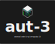

 

  

<h1 align="center" style="margin-top: 0;">AUT-3</h1>

  <strong>Volumetric Photonic Compute–Memory Architecture</strong>

 

AUT-3 is a proposed computer architecture where the entire machine—
compute, RAM, cache, GPU, and long-term storage—is implemented inside a **unified 3D photonic compute–memory volume**.  
There is no CPU/GPU/RAM hierarchy. The optical medium performs all computation and storage directly through wavelength-defined roles and volumetric optical transforms.

AUT-3 uses:
- **Dense Wavelength Division Multiplexing (DWDM)** for Storage / RAM / Compute separation  
- **Femtosecond compute pulses** for nonlinear operations without thermal damage  
- **3D tomographic readout** using multi-wavelength photodiode arrays  
- **Closed-Loop Wavelength Locking** to compensate for refractive-index drift  
- **Optional Z-Gating layers** as depth-selective write barriers  
- **Volumetric mesh scaling** for multi-node photonic compute fabrics  

This repository provides the full **architecture specification** and a **defensive publication** describing AUT-3 in sufficient detail for research, prototyping, and prior-art protection.

The specification is:
- Mechanically precise  
- Engineering-focused  
- Free of hype  
- Independent of specific materials  
- Written for long-term feasibility  

---

## Document Structure

- `AUT3_Master_Specification.md` — consolidated architecture specification  
- `spec/` — modular specification chapters  
- `defensive-publication/AUT3_Defensive_Publication.md` — formal defensive publication  

---

## Inventor Attribution

Inventor: `github.com/dustindwayne`, also known as **Dustin W.**

---

## License

AUT-3 is released under the **CERN Open Hardware Licence Version 2 – Strongly Reciprocal (CERN-OHL-S-2.0)**.  

AUT-3 logo © 2025 Dustin W. (github.com/dustindwayne)
